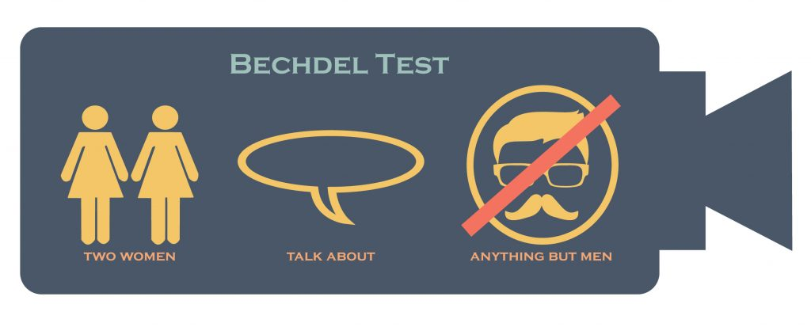
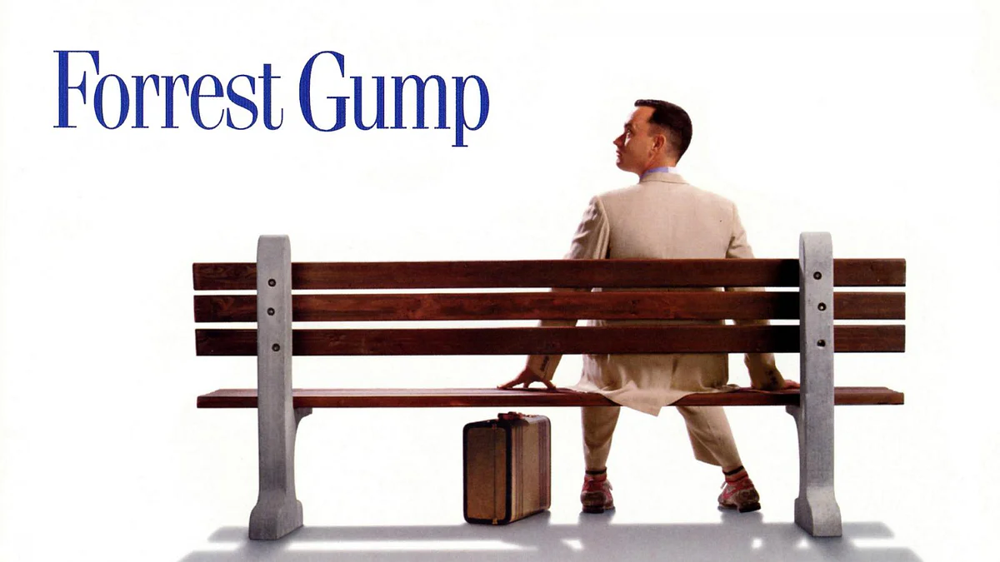
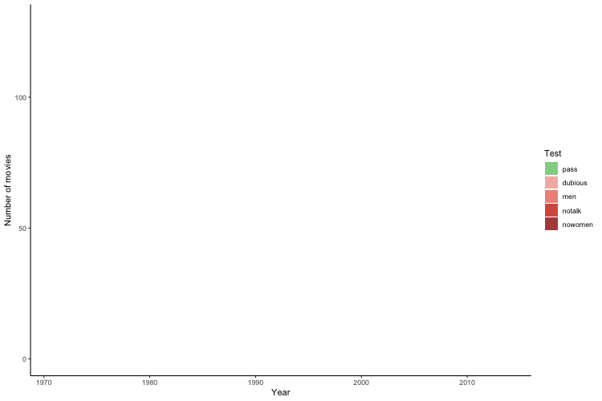

```{r xaringan-themer, include=FALSE, warning=FALSE}
library(xaringanthemer)
style_solarized_light(header_color = "#1F3065",
                      header_h1_font_size = "2.25rem",
                      header_h2_font_size = "1.75rem",
                      header_h3_font_size = "1.35rem",)
```

class: center, bottom, inverse

background-image: url(plots/bechdeltestcartoon.jpeg)

background-position: top

## Studies of Bechdel Test 

#### HE Qiu, HO Yin Shan, LYU Rui, SI Wen, SUN Weichen

#### `r Sys.Date()`

---


```{r setup, include=FALSE}
knitr::opts_chunk$set(echo = FALSE,
                      message = FALSE,
                      warning = FALSE)
library(tidyverse)
library(kableExtra)
library(plotly)
library(leaflet)
library(xaringanExtra)
library(lubridate)
library(gganimate)
library(gifski)
library(lubridate)
description <- read_csv("data/bechdel_data_description.csv")
bechdel_clean <- read_csv("data/bechdel_clean.csv")
xaringanExtra::use_panelset()
```


```{r}
raw_bechdel <- readr::read_csv('https://raw.githubusercontent.com/rfordatascience/tidytuesday/master/data/2021/2021-03-09/raw_bechdel.csv')
movies <- readr::read_csv('https://raw.githubusercontent.com/rfordatascience/tidytuesday/master/data/2021/2021-03-09/movies.csv')

movies_clean <- movies %>% 
  select(-c(imdb, code, period_code, decade_code, response, type, error, domgross, intgross, budget, released, actors, awards, test, writer, rated, plot)) %>% 
  mutate(year = as.integer(year),
         domgross_2013 = as.numeric(domgross_2013),
         intgross_2013 = as.numeric(intgross_2013)) %>% 
  separate(genre, c("genre1","genre2", "genre3"), sep = ',') %>% 
  separate(director, c("director1","director2", "director3"), sep = ',') %>% 
  separate(language, c("language1","language2", "language3"), sep = ',') %>% 
  separate(country, c("country1","country2", "country3"), sep = ',') %>% 
  separate(runtime, c("runtime", "min"), sep = " ") %>% 
  mutate(runtime = as.numeric(runtime)) %>% 
  select(-min)

factor_cols <- c("binary",
                 "genre1","genre2", "genre3",
                 "director1","director2", "director3", 
                 "language1","language2", "language3",
                 "country1","country2", "country3",
                 "clean_test")

bechdel_clean <- movies_clean %>% 
  mutate_each_(funs(factor(.)), factor_cols) %>%
  mutate(clean_test = factor(case_when(clean_test == "ok" ~ "Pass",
                                         clean_test == "dubious" ~ "Dubious",
                                         clean_test == "men" ~ "Women only talk\nabout men",
                                         clean_test == "notalk" ~ "Women don't talk\nto each other",
                                         clean_test == "nowomen" ~ "Fewer than two\nwomen")))


```

```{css echo = F}
.pull-right{width: 40%;}
.pull-left{width: 60%}
.font-color{color: #1F3065}
``` 

## Presentation Contents

.pull-left[

### - Introduction


### - Data Description


### - Bechdel Results Analysis:
.font-color[
1. IMDB Ratings
2. Time Change
3. Region
4. Genre 
5. Runtime
6. Budget & ROI
]


### - Conclusion & Limitations


### - References
]

.pull-right[

]

---

## Introduction

--
- A technique to evaluate female participation in a movie

--

- Origin from a comic 'Dykes to Watch Out For' (1985)

--

- Named after the cartoonist Alison Bechdel

--

- Reflect gender bias in a movie

--

## Criteria of passing the test
--
 

---


.pull-left[

### Data Overview

```{r, message=FALSE, out.width="80%"}
visdat::vis_dat(bechdel_clean,
                palette = "cb_safe")
```


- Topic from **TidyTuesday**
- Data Source: **GitHub**
- **movies.csv** : 8839 x 5
- **raw_bechdel.csv** : 1794 x 34

]

.pull-right[

### Data Dictionary

```{r}
description %>% 
 kable(align = "c", 
      col.names = c("Variables","Description", "Type")) %>% 
  row_spec(0, color = "white", background = "#277BC0") %>% 
  column_spec(1, background = "white") %>% 
  column_spec(2, background = "white") %>% 
  column_spec(3, background = "white") %>% 
  kable_styling(bootstrap_options = "striped", font_size = 12, ) %>% 
  scroll_box(width = "100%", height = "500px")
```

]

---

.panelset[

.panel[.panel-name[Overview of the test]

   

  

]

.panel[.panel-name[Analysis]

```{r, out.width="100%"}
color.test <- c(FAIL = '#A93226', PASS = '#237C3A')

 toprating30 <- bechdel_clean %>% 
  select(title, imdb_rating, imdb_votes, binary, clean_test, budget_2013, year, metascore) %>% 
  arrange(desc(imdb_rating), desc(imdb_votes)) %>% 
  head(30)

bechdel_imdb_budget <- bechdel_clean %>% 
  select(title, imdb_rating, imdb_votes, binary, clean_test, budget_2013, year, metascore) %>% 
  arrange(imdb_rating, desc(imdb_votes)) %>% 
  head(30) %>% 
  rbind(toprating30) %>% 
  ggplot((aes(year, imdb_rating, 
              color = binary,
              size = budget_2013,
              text = title))) +
  geom_point(position = "jitter")+
  theme_classic() +
  labs(title = "Bechdel test with respect to the IMDB ratings (bubble size = budget)",
       x = "Year",
       y = "IMDB rating")+
  scale_color_manual(values = color.test)

ggplotly(bechdel_imdb_budget) 
```

- First 30 and Last 30 in IMDB ratings were chosen

]
]

---

```{css echo = F}
.fail-font{
  font-weight: bold;
  font-style: italic;
  font-size: 1.5em;
  color: darkred;
}

.pass-font{
  font-weight: bold;
  font-style: italic;
  font-size: 1.5em;
  color: darkgreen;
}
```


### The trend of Bechdel Test Results

.panelset[

.panel[.panel-name[By Number]



```{r eval=FALSE}
test_movie<- bechdel_clean %>% 
  mutate(year = as.Date(as.character(bechdel_clean$year), format = "%Y")) %>%
  group_by(year, clean_test) %>% 
  count()

test_movie <- test_movie %>% mutate(clean_test = recode(clean_test, "Dubious" = "dubious",
                                           "Women only talk\nabout men" = "men",
                                           "Women don't talk\nto each other" = "notalk",
                                           "Fewer than two\nwomen" = "nowomen",
                                           "Pass" = "pass"))

test_movie$clean_test <- factor(test_movie$clean_test, levels = c("dubious",
                                           "men",
                                           "notalk",
                                           "nowomen",
                                           "pass"
                                           ))

test<- test_movie %>% 
  pivot_wider(names_from = clean_test,
              values_from = n) %>% 
  pivot_longer(cols = c("dubious","men", "notalk","nowomen","pass"),
               names_to = "clean_test",
               values_to = "count")
d[is.na(d)] <- 0
 test$count[is.na(test$count)] <- 0

animate <- test %>% 
  ggplot(aes(year, count, fill = clean_test))+
  geom_area()+
  theme_classic() +
  theme(legend.position = "right") +
  labs(x = "Year",
      y = "Number of movies") +
  guides(fill=guide_legend(title="Test"))+
  scale_fill_manual(values = c(pass = "#95D196", 
                               dubious = "#F5B7B1", 
                               men = "#F1948A",
                               notalk = "#D85C4D",
                               nowomen = "#B44C4B"))+
  transition_reveal(year)

animate(animate,fps = 15, height = 500, width =750, end_pause = 15, renderer = gifski_renderer("plots/animation.gif"))

```

]

.panel[.panel-name[Explanations]


### Result of the Bechdel test with 5 levels

- .fail-font[dubious]    
  the topic the conversation between the women in the picture was dubious
    
- .fail-font[men]  
  the women in the picture only talked about men
  
- .fail-font[notalk]    
  the women in the picture did not talk to each other

- .fail-font[nowomen]    
  there was less than 2 named women in the picture
  
- .pass-font[ok]   
  passed the test
  
]

.panel[.panel-name[By percentage]

```{r, out.width="100%", out.height = "90%"}
color.group <- c(FAIL = '#B44C4B', PASS = '#6C976C')

test_prop <- bechdel_clean %>% 
  mutate(five_year = floor(year/5) * 5) %>% 
  count(five_year, binary) %>% 
  group_by(five_year)%>% 
   mutate(prop = n/sum(n)) %>% 
  ggplot(aes(five_year, prop, fill = binary)) +
  geom_col() +
  geom_hline(yintercept = 0.5, linetype = "dashed", size = 0.5, color = "#004E97")+
  theme_classic() +
  theme(legend.position = "right") +
  labs(x = "Year",
      y = "Proportion") +
  scale_y_continuous(label = scales::percent,
                       breaks = seq(0, 1, by = 0.2))+
  scale_fill_manual(values = color.group) +
  guides(fill=guide_legend(title="Bechdel test")) 

  ggplotly(test_prop)
```

]
]
---

### Regions

.panelset[
.panel[.panel-name[Leaflet]

```{r}
total <- bechdel_clean %>% 
  select(year, title, binary, country1) %>% 
  na.omit() %>% 
  group_by(country1) %>% 
  tally() %>% 
  rename(total = n) %>% 
  ungroup()

pass_rate_country <- bechdel_clean %>% 
  group_by(binary, country1) %>% 
  filter(binary == "PASS") %>% 
  tally() %>% 
  na.omit() %>% 
  left_join(total) %>% 
  filter(total >= 5) %>% 
  mutate(`Passing Rate` = round(100*n/total , digits = 2))
```

```{r}
markers1 <- data.frame(Country = c("Australia", "Canada","France","Germany","Hong Kong","Spain", "UK", "USA" ),
                      description = c("Canberra, Australia: 42.86%", 
                                      "Ottawa, Canada: 47.83%",
                                      "Paris, France: 45.16%",
                                      "Berlin, Germany: 53.85%",
                                      "Hong Kong SAR: 20.00%",
                                      "Madrid, Spain: 60.00%",
                                      "London, UK : 48.30%",
                                      "Washing DC, USA: 43.24%"),
                      latitude = c(-35.282001, 45.424721, 48.864716, 52.520008, 22.302711, 40.416775, 51.509865, 38.889805),
                      longitude = c(149.128998, -75.695000, 2.349014, 13.404954, 114.177216, -3.703790, -0.118092, -77.009056))


markers2 <- data.frame(Country = c("Germany","Spain"),
                      description = c("Berlin, Germany: 53.85%",
                                      "Madrid, Spain: 60.00%"),
                      latitude = c(52.520008,40.416775),
                      longitude = c(13.404954, -3.703790))


icon.red <- makeAwesomeIcon(icon= 'circle', markerColor = 'darkred')
icon.green <- makeAwesomeIcon(icon = 'circle', markerColor = 'darkgreen')

leaflet <- leaflet() %>% 
  addTiles() %>% 
  addAwesomeMarkers(lng = ~longitude,
        lat = ~latitude,
        popup = ~description,
        data = markers1,
        icon = icon.red) %>% 
  addAwesomeMarkers(lng = ~longitude,
        lat = ~latitude,
        popup = ~description,
        data = markers2,
        icon = icon.green) 
  
f <- paste0("leaflet.html")
htmlwidgets::saveWidget(leaflet, f)
htmltools::tags$iframe(
    src=f,
    width="100%", 
    height="400px",
    scrolling="no", 
    seamless="seamless", 
    frameBorder="0"
  )
```

]

.panel[.panel-name[Analysis]

.pull-left[


#### - Include Regions with **>5 data** only 

#### - **Most of the countries failed** the test

#### - **2 out of 3 Indian movies** passed

  

]

.pull-right[


```{r}
bechdel_clean %>% 
  select(year, title, binary, country1) %>% 
  na.omit() %>% 
  group_by(binary, country1) %>% 
  tally() %>% 
  mutate(binary = as.character(binary)) %>% 
  pivot_wider(names_from = binary,
              values_from = n) %>% 
  na.omit() %>% 
  mutate(RATE = round(PASS*100/(PASS+FAIL),2)) %>% 
  arrange(desc(RATE)) %>% 
  kable(align = "c", 
      col.names = c("Location","FAILURE", "PASS", "PASSING RATE (%)")) %>% 
  row_spec(0, color = "white", background = "#82C5D2") %>% 
  kable_styling(bootstrap_options = "striped", font_size = 14) 

```

]

]
]

---

### Genre

```{r out.width="90%"}
genre<- movies_clean %>%
  drop_na(genre1) %>% 
  mutate(binary = ifelse(binary == "PASS", 1, 0)) %>% 
  group_by(genre1) %>% 
  summarise(percentage_pass = mean(binary),
            n = n()) %>% 
  ungroup() %>% 
  top_n(10, n) %>% 
  mutate(genre1 = reorder(genre1, percentage_pass)) %>% 
  ggplot(aes(genre1, percentage_pass)) +
  geom_col(fill = "#82C5D2")+ 
   geom_hline(yintercept = 0.5, linetype = "dashed", color = "red4")+
  theme_classic() +
  coord_flip()+
    labs(title = "The Bechdel test passing rate for Top 10 genres",
       subtitle = "Horror pass the Bechdel Test most frequently, while Mystery do so just 23% of the time.",
       caption = "Figure 8",
       x = "Genre",
       y = "Percentage of films that pass the Bechdel Test")+
  scale_y_continuous(label = scales::percent,
                       breaks = seq(0, 0.7, by = 0.1))


ggplotly(genre)
```

- Highest passing rate in **Horror movies**
- Only **horror**, **drama** and **comedy** genre pass

---

### Runtime 

```{r out.width="100%"}
topruntime10 <- movies_clean %>% 
  select(binary, runtime, title) %>% 
  na.omit() %>% 
  group_by(binary) %>% 
  arrange(desc(runtime)) %>% 
  head(10) 

runtime <- movies_clean %>% 
  select(binary, runtime, title) %>% 
  na.omit() %>% 
  arrange(runtime) %>% 
  head(10) %>% 
  rbind(topruntime10) %>% 
  ggplot(aes(x = runtime,
             y = reorder(title,runtime),
             color = binary))+ 
  geom_point()+
  theme_bw() +
  labs(title = "Bechdel test results based on runtime",
       x = "Run time (in minutes)",
       y = "Movie Title") +
  scale_color_manual(values = color.test)

ggplotly(runtime)
```

- The test results **not likely affected by runtime**

---
.panelset[
.panel[.panel-name[Budget]

```{r out.width= "100%"}
budget_plot <- movies_clean %>% 
   mutate(return = intgross_2013  / budget_2013,
         decade = floor(year/10) * 10) %>% 
  group_by(binary, decade) %>% 
  summarise(mean_budget = mean(budget_2013, na.rm = TRUE),
            mean_return = mean(return, na.rm = TRUE)) %>% 
  ggplot(aes(x = decade,
             y = mean_budget,
             fill = binary))+
  geom_col(position = "dodge") + 
  theme_classic() +
  labs(title = "The Bechdel test with respect to the averagte films budget",
      caption = "Figure 5",
      x = "Bechdel test binary result",
      y = "Average budget (in million USD)") +
  scale_y_continuous(label = scales::unit_format(unit = "", scale = 1e-6),
                       breaks = seq(0, 70000000, by = 10000000)
                     ) +
  scale_fill_manual(values = color.group)

ggplotly(budget_plot)
```

- More investments in **male dominant movies**

]

.panel[.panel-name[ROI]

```{r out.width="100%"}
roi <- movies_clean %>% 
  filter(year>1990) %>% 
  mutate(return = (intgross_2013 -  budget_2013)  / budget_2013,
         decade = floor(year/10) * 10) 

roi_plot <- roi %>% 
  group_by(binary, decade) %>% 
  ggplot((aes(binary, 
              log(return),
              fill = binary
              ))) +
  geom_boxplot(aes(text = title)) +
  facet_wrap(~decade, scales = "free") +
  theme_classic() +
  theme(legend.position = "none") +
  labs(title = "Return of investment by the Bechdel test result over decades",
      subtitle = "Decades from 1990 - 2010 with ROI on Bechdel test",
      caption = "Figure 6",
      x = "Bechdel test",
      y = "Log return")+
  scale_fill_manual(values =color.group)

ggplotly(roi_plot, tooltip = "text") 
```

- Movies **passed** slightly outperformed the **failed**

]]


---

### Conclusion & Limitations
--

1. **More female participation** in the movie but still **low passing rate**

--

2. Female tend to play more important role in **German and Spanish movies**

--

3. Female tend to play relatively important in **horror, comedy and drama** genre movies

--

4.  Investors of Movie industry invested more in the **male dominant movies**

--

5. Movies with **female participation** tend to have **relatively higher profit**

--

6. Results of the test are **not affected by runtime**

--

7. Data **coverage is not enough** 

 

---
# References

- Thomas Mock (2021). Tidy Tuesday: A weekly data project aimed at the R ecosystem. https://github.com/rfordatascience/tidytuesday.
- Walt Hickey (Apr 1, 2014). FiveThirtyEight: The Dollar-And-Cents Case Against Hollywood’s Exclusion of Women. https://fivethirtyeight.com/features/the-dollar-and-cents-case-against-hollywoods-exclusion-of-women/
- Wickham et al., (2019). Welcome to the tidyverse. Journal of Open Source Software, 4(43), 1686, https://doi.org/10.21105/joss.01686
- Antoine Fabri (2020). unglue: Extract Matched Substrings Using a Pattern. R package version 0.1.0. https://CRAN.R-project.org/package=unglue
- Garrett Grolemund, Hadley Wickham (2011). Dates and Times Made Easy with lubridate. Journal of Statistical Software, 40(3), 1-25. URL https://www.jstatsoft.org/v40/i03/.
- Hao Zhu (2021). kableExtra: Construct Complex Table with 'kable' and Pipe Syntax. R package version 1.3.4. https://CRAN.R-project.org/package=kableExtra
- Elin Waring, Michael Quinn, Amelia McNamara, Eduardo Arino de la Rubia, Hao Zhu and Shannon Ellis (2021). skimr: Compact and Flexible Summaries of Data. R package version 2.1.3. https://CRAN.R-project.org/package=skimr

---

- Nicholas Tierney, Di Cook, Miles McBain and Colin Fay (2021). naniar: Data Structures, Summaries, and Visualisations for Missing Data. R package version 0.6.1. https://CRAN.R-project.org/package=naniar
- Thomas Lin Pedersen (2020). patchwork: The Composer of Plots. R package version 1.1.1. https://CRAN.R-project.org/package=patchwork
- Stefan Milton Bache and Hadley Wickham (2020). magrittr: A Forward-Pipe Operator for R. R package version 2.0.1. https://CRAN.R-project.org/package=magrittr
- Winston Chang, (2014). extrafont: Tools for using fonts. R package version 0.17. https://CRAN.R-project.org/package=extrafont
- Hadley Wickham (2021). tidyr: Tidy Messy Data. R package version 1.1.3. https://CRAN.R-project.org/package=tidyr
- Claus O. Wilke (2020). ggtext: Improved Text Rendering Support for 'ggplot2'. R package version 0.1.1. https://CRAN.R-project.org/package=ggtext
- Thomas Lin Pedersen (2021). ggforce: Accelerating 'ggplot2'. R package version 0.3.3. https://CRAN.R-project.org/package=ggforce
- C. Sievert. Interactive Web-Based Data Visualization with R, plotly, and shiny. Chapman and Hall/CRC Florida, 2020.
- Thomas Lin Pedersen (2020). patchwork: The Composer of Plots. R package version 1.1.1. https://CRAN.R-project.org/package=patchwork
- Data downloaded from https://bechdeltest.com

---

